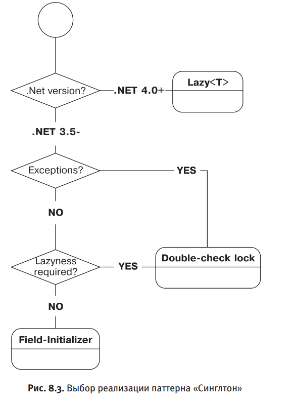

# Singleton
## Применимость Singleton
Singleton необходимо применять с осторожностью и лишь в некоторых случаях. 
Ситуации, когда Singleton применим:
 - **Singleton без видимого состояния** - стабильная справочная информация или некоторые утилиты.
 - **Настраиваемый контекст** - протаскивание инфраструктурных зависимостей в виде Ambient Context 
	(Singleton, который возвращает абстрактный класс или интерфейс, который можно установить в начале выполнения программы).
## Best Practice при использовании Singleton
 - **Минимальная область использования** - Ограничьте использование Singleton минимальным числом классов и модулей.
 - **Singleton в Mediator** - пусть Singleton, возвращающий бизнес-объект, будет использоваться в нескольких
	классах-медиаторах, которые потом будут передавать его на более низкий уровень.
 - **Используйте Singleton явно** - используйте Singleton в качестве значения при объявлении переменной. Тогда будет удобнее отслудить, в каких классах используется Singleton.
## Выбор реализации паттерна Singleton  
